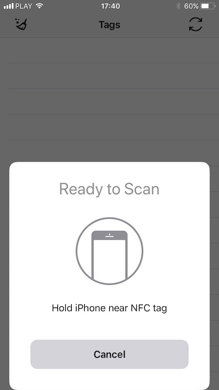

# CoreNFCDemo

CoreNFCDemo is a sample project to show capabilities of new CoreNFC framework added by apple in iOS11

## How to build project?
  - You have to add new app in [Apple Developer](https://developer.apple.com/) site
  - Add NFC reader capability
  - Create new provisioning profile
  - Change bundle id in project to match the one in provisioning profile
  - Because I added SnapKit pod for UI you need to open **NFCDemo.xcworkspace** in Xcode, not NFCDemo.xcodeproj
  
 ## Requirements
 You have to have **Xcode9** and **iOS 11** on your device.
 
 Also CoreNFC works only with **iPhone 7** and **iPhone 7 Plus**
 
 ## Q&A
  - There is **No such module 'CoreNFC'** when I try to build the project
      - You can only run this project on actual device. It's not possible to build it when any iOS simulator is selected.
      
  - 'Unknown' error shows up in delegate even when CoreNFC reads a tag
      - Yes, I'm getting it as well. I have no idea why CoreNFC returns tag data and Unknown error at the same time
  
  - I cannot read any tag
      - You can only use CoreNFC to read NDEF tags. Most of the cards (i.e credit cards, member cards) cannot be read with the framework
      
  - Sometimes I cannot read proper tag
     - ~~It looks like sometimes NFC chip gets freeze and cannot read any tag. I hope it'll be fixed in future betas~~
     **This has been fixed in iOS 11 Beta 3**
  
  - I can build the project on iPhone 6s but there is no NFC dialog
      - You can only use CoreNFC with iPhone 7 and iPhone 7 Plus. On other devices you'll get **FeatureUnsupported** error
      
## Credits
I've used two icons from [https://icons8.com](https://icons8.com) which are under Creative Commons Attribution-NoDerivs 3.0 Unported license

## License
MIT License

Copyright (c) 2017 Piotr Debosz

Permission is hereby granted, free of charge, to any person obtaining a copy
of this software and associated documentation files (the "Software"), to deal
in the Software without restriction, including without limitation the rights
to use, copy, modify, merge, publish, distribute, sublicense, and/or sell
copies of the Software, and to permit persons to whom the Software is
furnished to do so, subject to the following conditions:

The above copyright notice and this permission notice shall be included in all
copies or substantial portions of the Software.

THE SOFTWARE IS PROVIDED "AS IS", WITHOUT WARRANTY OF ANY KIND, EXPRESS OR
IMPLIED, INCLUDING BUT NOT LIMITED TO THE WARRANTIES OF MERCHANTABILITY,
FITNESS FOR A PARTICULAR PURPOSE AND NONINFRINGEMENT. IN NO EVENT SHALL THE
AUTHORS OR COPYRIGHT HOLDERS BE LIABLE FOR ANY CLAIM, DAMAGES OR OTHER
LIABILITY, WHETHER IN AN ACTION OF CONTRACT, TORT OR OTHERWISE, ARISING FROM,
OUT OF OR IN CONNECTION WITH THE SOFTWARE OR THE USE OR OTHER DEALINGS IN THE
SOFTWARE.
